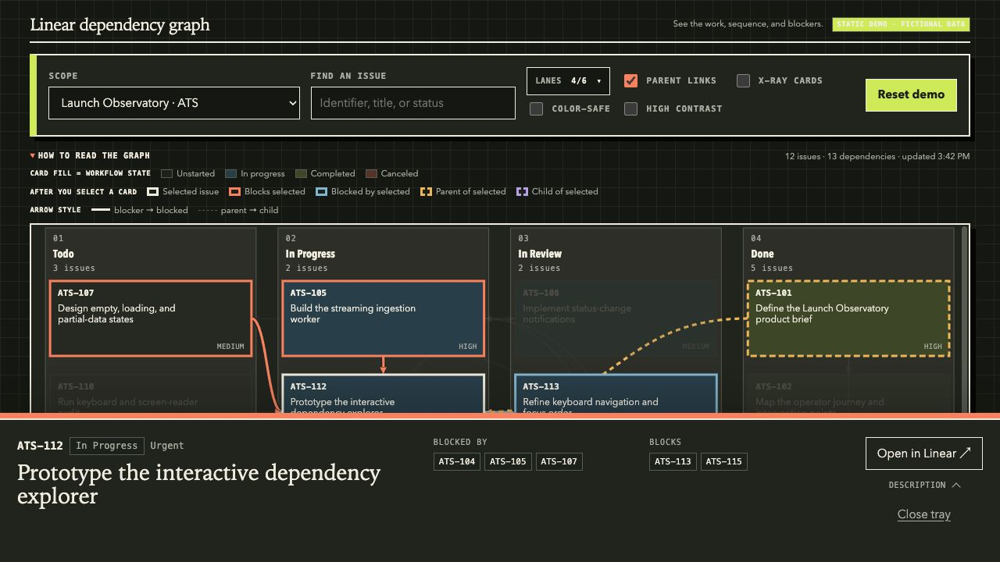

# Linear Dependency Graph

A local, interactive map of blockers, blocked issues, parent relationships, and
workflow status for any Linear project or team.

The application is intentionally small: one Node server and a browser UI built
with native HTML, CSS, JavaScript, and SVG. Your Linear API key stays in the
local server process and is never exposed to the browser.

## Demo

[Try the interactive demo](https://wevial.github.io/linear-dep-graph/) with
fictional projects, teams, issues, and dependencies. It runs entirely in the
browser and does not require a Linear account or API key.

[](https://wevial.github.io/linear-dep-graph/)

## What it does

- Lists every active Linear project and team visible to your API key.
- Groups issues by their actual Linear workflow status.
- Draws blocker → blocked arrows and optional parent → child links.
- Shows each issue identifier, title, priority, blockers, downstream work, and a
  compact/expandable Markdown description tray.
- Supports project/team switching, lane filtering, issue search, selection tracing, and manual refresh.
- Includes separate Color-safe and High contrast modes that can be combined.
- Refreshes the selected scope on a configurable interval with server-side caching.
- Runs entirely on `127.0.0.1` by default.

## Requirements

- Node.js 22.12 or newer.
- A Linear personal API key with access to the projects or teams you want to inspect.

## Quick start

```bash
gh repo clone wevial/linear-dep-graph
cd linear-dep-graph
cp .env.example .env
chmod 600 .env
```

Add your key to `.env`:

```dotenv
LINEAR_API_KEY=your_linear_api_key
```

Then run:

```bash
npm install
npm start
```

Open [http://127.0.0.1:43117](http://127.0.0.1:43117).

To keep it running after the terminal closes:

```bash
npm run background
```

Stop the background process with:

```bash
npm run stop
```

The Markdown renderer is sanitized on the local server before issue
descriptions are sent to the browser.

## Configuration

| Variable | Default | Purpose |
| --- | --- | --- |
| `LINEAR_API_KEY` | — | Required personal Linear API key. |
| `HOST` | `127.0.0.1` | Interface used by the local HTTP server. |
| `PORT` | `43117` | Local HTTP port. |
| `DEFAULT_PROJECT_ID` | — | Optional project UUID to preselect. |
| `REFRESH_INTERVAL_MS` | `300000` | Client refresh and server cache interval. |
| `LINEAR_API_URL` | Linear GraphQL endpoint | Optional endpoint override for development. |
| `ENV_FILE` | `.env` | Optional path to a different environment file. |

The UI remembers the last selected scope, lane choices, and accessibility modes
in browser local storage.

## Security model

This project is designed as a single-user local tool:

- `.env` is ignored by Git.
- The API key is sent only from the Node server to Linear.
- Browser API responses never include the key.
- The default host is loopback-only.
- Responses include a restrictive Content Security Policy.
- The application performs read-only GraphQL queries.

Personal API keys are appropriate for local scripts and tools. A hosted or
multi-user version should use Linear OAuth instead of collecting personal keys.
See [SECURITY.md](SECURITY.md) before changing the bind address or deploying it.

## How the graph works

The server fetches project- or team-scoped issues in pages of 100 and requests
only the fields needed by the graph. It deduplicates two relationship types:

- `blocks`: rendered as a solid arrow from blocker to blocked issue.
- `parent`: rendered as a dashed line from parent to child.

Relationships whose other endpoint is outside the selected scope are omitted
from the canvas. This keeps every visible node tied to the chosen project or
team.

## Development

```bash
npm run dev
npm test
npm run check
npm run build:demo
```

The tests use Node's built-in test runner. The local Linear-backed application
requires no build step; `npm run build:demo` creates the ignored `dist/`
artifact used by GitHub Pages.

## Contributing

Issues and focused pull requests are welcome. Read [CONTRIBUTING.md](CONTRIBUTING.md)
for the project conventions.

## License

[MIT](LICENSE)
